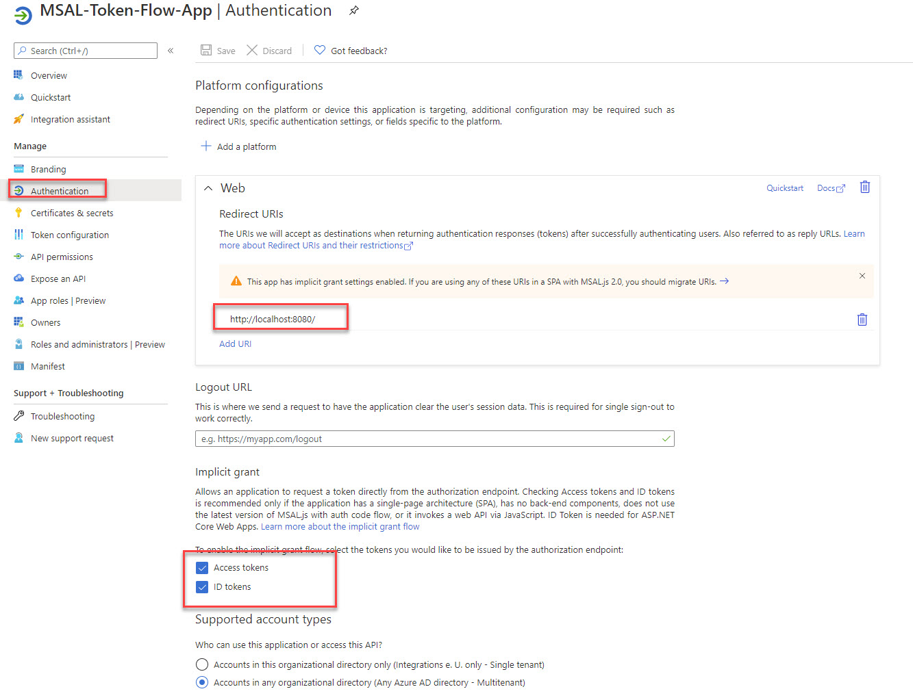
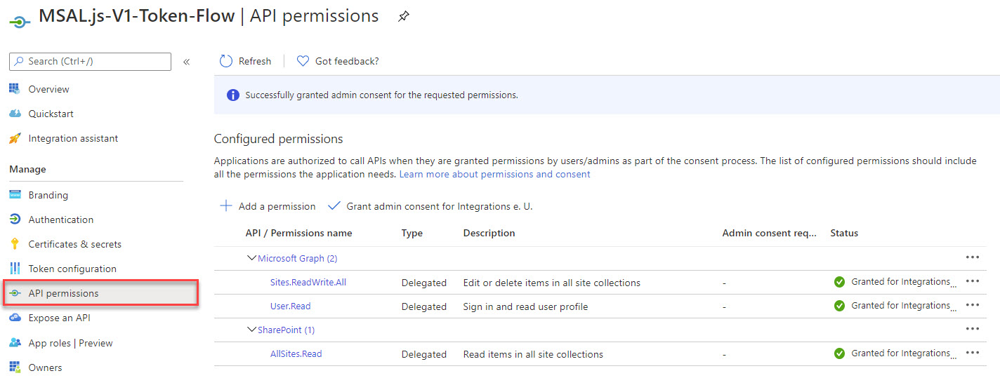
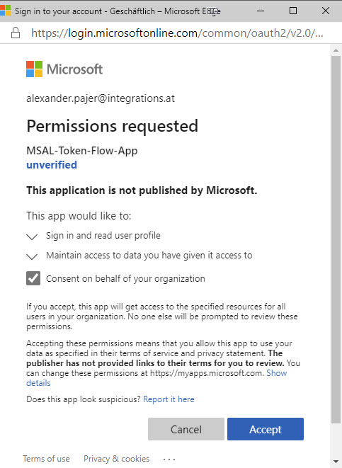

# Token Flows MSAL.js 1.x and 2.x

Demos require [http-server](https://www.npmjs.com/package/http-server)

- Use `MSAL.js-V1-Token-Flow` app registration

## App Registration





## Run Demo

Replace tanant id und client id in `index.js`:

```javascript
async function doAuth() {
  const tenant = "d92b247e-90e0-4469-a129-6a32866c0d0a";
  const config = {
    auth: {
      clientId: "eeb155cb-d4c6-4864-9184-cf10a6e02715",
      authority: `https://login.microsoftonline.com/${tenant}`,
      redirectUri: "http://localhost:8080",
    },
  };
```

> Note: [Application Configuration Options - Authority](https://docs.microsoft.com/en-us/azure/active-directory/develop/msal-client-application-configuration)

Install http-server:

```
npm i -g http-server
```

> Note: Requires [Note.js](https://nodejs.org/download/release/v10.23.0/)

Run project:

```
cd ./token-flow-node
npm i
http-server
```

> Note: Use http://localhost:8080/ as this is used in the App Registation

Consent Screen:


