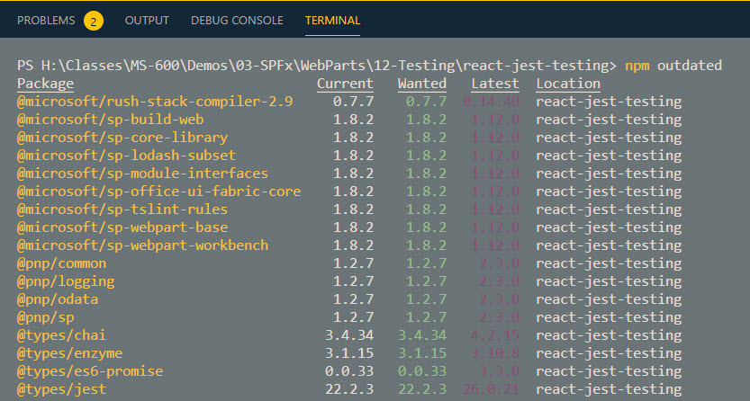

# Asset Deployment

## Demos

- Show Asset Deployment
- Explain Web Pack Bundle Analyzer
- Explain Packaging Metadata

  ```
  "includeClientSideAssets": true,
      "skipFeatureDeployment": false,
      "features": [
      {
          "title": "Asset Deployment Demo",
          "description": "Asset Deployment Demo",
          "id": "d46cd9d6-87fc-473b-a4c0-db9ad9162b64",
          "version": "1.1.0.1",
          "assets": {
          "elementManifests": ["elements.xml"],
          "elementFiles": ["schema.xml"]
          }
      }
      ],
  ```

- Explain Updating

## Readings

[SharePoint solution packaging](https://docs.microsoft.com/en-us/sharepoint/dev/spfx/web-parts/basics/notes-on-solution-packaging)

[Introduction to Collaborative Application Markup Language](https://docs.microsoft.com/en-us/sharepoint/dev/schema/introduction-to-collaborative-application-markup-language-caml)

## Updating SPFx

Find outdated Packages:

```
npm outdated
```



Update Package

```
npm i -s @microsoft/sp-build-web@version
....
```

Update Generator

```
npm install -g @microsoft/generator-sharepoint@latest
```

Updating can also be done using [CLI for Microsoft 365](https://pnp.github.io/cli-microsoft365/cmd/spfx/project/project-upgrade/):

```
m365 spfx project upgrade --toVersion 1.5.0 --output md > "upgrade-report.md"
```
