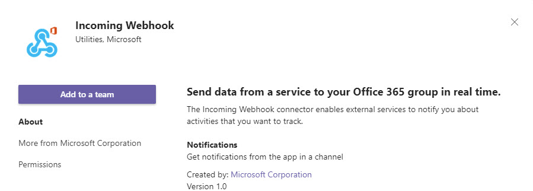
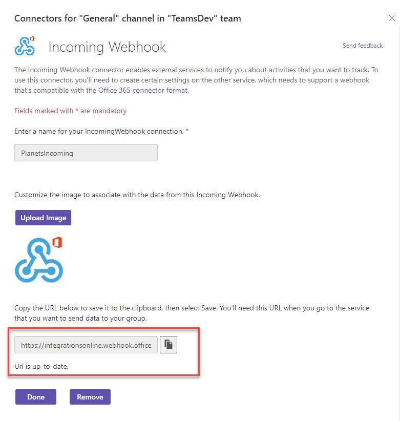

# Webhooks

[Webhooks & Connectors](https://docs.microsoft.com/en-us/microsoftteams/platform/webhooks-and-connectors/what-are-webhooks-and-connectors)

## OutgoingWebhook

- Listens for requests at `/api/webhook` using `requestHandler()` defined in WEBHOOKNAME.ts
- Uses an adavtive card `planetDisplayCard.json`
- Processes the request using `processAuthenticatedRequest`
- Serve in two seperate terminals using:

  ```
  gulp serve
  ```

  ```
  ngrok http 3007
  ```

- Register Outgoing Webhook in Teams

  

  

  

- Copy token and add it to `.env`

  

## Incoming Webhook - no Teams code needed

- Register Incoming Webhook

  

  

- Invoke the incomint Webhook:

  ```
  Invoke-RestMethod -Method post -ContentType 'Application/Json' -Body '{"text":"Hello World!"}' -Uri <YOUR WEBHOOK URL>
  ```

  > Note: Copy the Webhook Url. Example: `https://integrationsonline.webhook.office.com/webhookb2/552611f2-3437-4290-98ae-1c8dca98b9cf@d92b247e-90e0-4469-a129-6a32866c0d0a/IncomingWebhook/adba3096e6fe404ca88d9bfcfce2efac/25853297-1418-4fc4-96ec-22f8bc83a64b`
