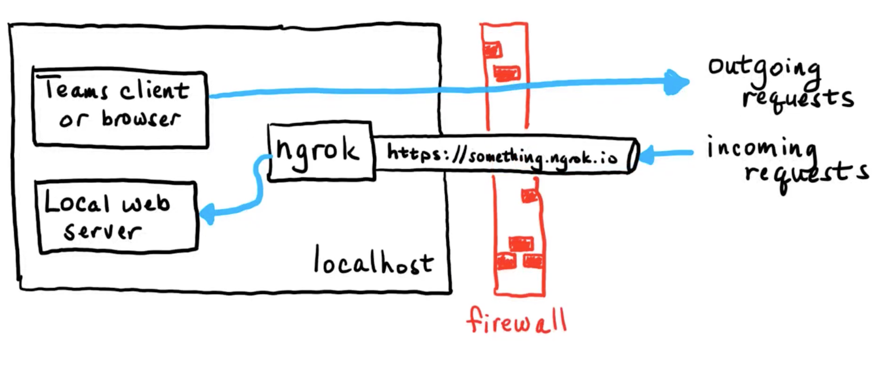

# Introduction to Microsoft Teams Development

## Demos

- Getting Started & Setup
- Personal- & Configurable Tabs
- TaskModules & Adaptive Cards
- Outgoing- and Incoming-Webhooks
- Message Extensions Extensions
- Bots

## Readings

[Teams Dev Center](https://dev.teams.microsoft.com/)

[Microsoft Teams Dev Center Reference](https://docs.microsoft.com/en-us/microsoftteams/platform/overview)

[Teams Developer Reference](https://docs.microsoft.com/en-us/microsoftteams/platform/overview)

[Teams Client SDK](https://docs.microsoft.com/en-us/microsoftteams/platform/tabs/how-to/using-teams-client-sdk)

[Microsoft Teams JavaScript client SDK](https://docs.microsoft.com/en-us/javascript/api/overview/msteams-client?view=msteams-client-js-latest)

[Single Sign-On for Teams](https://docs.microsoft.com/en-us/microsoftteams/platform/tabs/how-to/authentication/auth-aad-sso)

[Teams Samples](https://github.com/OfficeDev/Microsoft-Teams-Samples)

[fluentui/react-northstar](https://fluentsite.z22.web.core.windows.net/)

## Tools & Extensions

[Microsoft Teams Toolkit VS Code Extension](https://marketplace.visualstudio.com/items?itemName=TeamsDevApp.ms-teams-vscode-extension)

[Microsoft Teams Manifest Editor Online](https://dev.teams.microsoft.com/appconfiguration.html)

[Adaptive Card Studio](https://marketplace.visualstudio.com/items?itemName=madewithcardsio.adaptivecardsstudiobeta)

## Setup Environment

[Setup Teams Dev Environment](https://docs.microsoft.com/en-us/microsoftteams/platform/build-your-first-app/build-first-app-overview#get-prerequisites)

For Teams Development a tool called [ngrok](https://ngrok.com/download) is required. Ngrok provides a secure incoming tunnel that is required to allow incoming requests used for bots and messaging extensions

