# Exercise 3: Understanding tabs in Microsoft Teams

## Task 1: Create a personal tab

This task explains how to use Visual Studio Code and App Studio to create a personal tab. For this task, you are going to modify the app you created in the first exercise.

### Add personal tab

1. Open your recent solution folder **C:\LabFiles\Teams\MyTeamsApp** in **Visual Studio Code**.

1. To add a personal tab to this application you'll create a content page and update existing files. In your code editor, create a new HTML file in **./src/app/web/[yourDefaultTabNameTab]/** and name it **personal.html**. Add the following markup:

    ```html
    <!DOCTYPE html>
    <html>
        <head>
            <meta charset="UTF-8">
            <title>
                <!-- Todo: add your a title here -->
            </title>
            <meta name="viewport" content="width=device-width, initial-scale=1.0">
            <!-- inject:css -->
            <!-- endinject -->
        </head>
            <body>
                <h1>Personal Tab</h1>
                <p></p>
                <p>This is your personal tab!</p>
            </body>
    </html>
    ```

    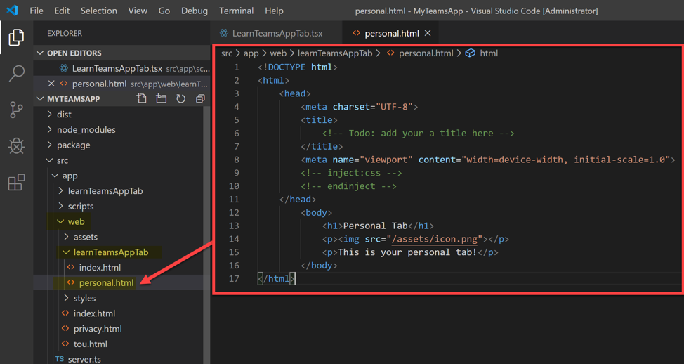

1. Open **manifest.json**.

1. Find the **staticTabs** array (**staticTabs":[]**). Place a **comma** (**,**) after the first static tab add the following **JSON**.

    ```json
    {
        "entityId": "personalTab",
        "name": "Personal Tab ",
        "contentUrl": "https://{{HOSTNAME}}/[yourDefaultTabNameTab]/personal.html",
        "websiteUrl": "https://{{HOSTNAME}}",
        "scopes": ["personal"]
    }
    ```

1. Update the **"contentURL"** path component **[yourDefaultTabNameTab]** to your actual tab name **learnTeamsAppTab**. Your manifest should look like the image below.

    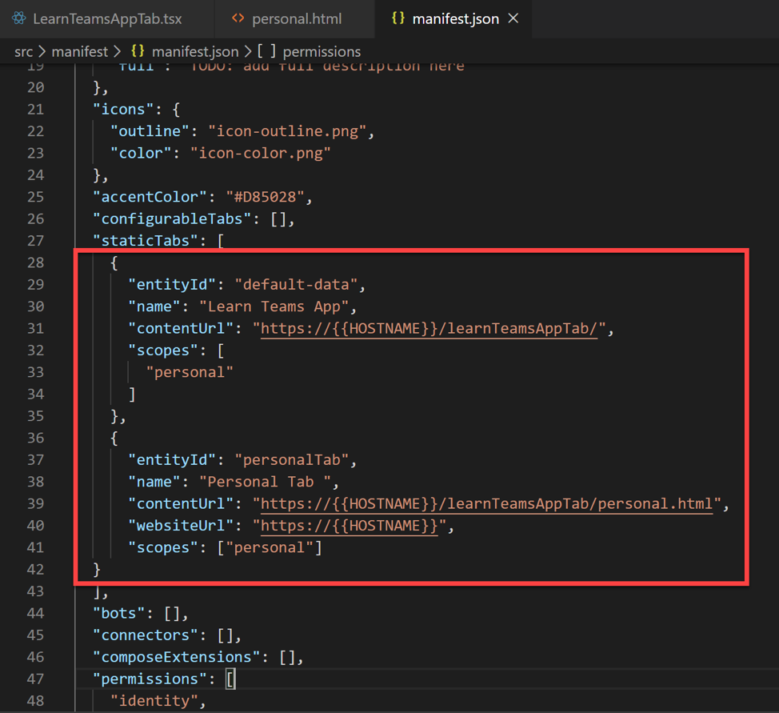

1. Save the updated **manifest.json**.

### Run your app

From the Visual Studio Code terminal window, run the command `gulp ngrok-serve` to run your app.
Since you have two static tabs in your solution you can browse to each one individually to test.
1. Browse to **http://localhost:3007/learnTeamsAppTab/** to your app’s homepage.

1. Browse to **http://localhost:3007/learnTeamsAppTab/personal.html** to view your new personal tab.

    **Note**:
    Here’s a side-by-side of image of both of the pages open to show your tabs.

    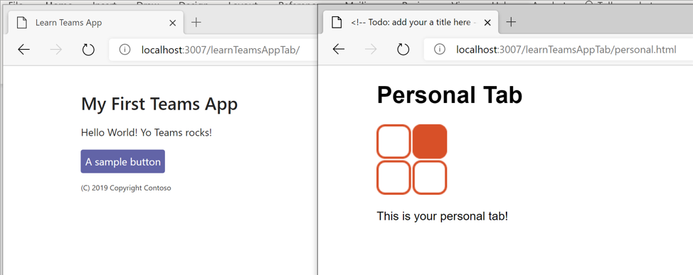

1. Your content page must be served in an Iframe. Open **LearnTeamsAppTab.ts** in Visual Studio Code.

    1. Full location: **.\src\app\learnTeamsAppTab\LearnTeamsAppTab.ts**

1. Add the following below the existing Iframe decorator.

    ```typescript
    @PreventIframe("/learnTeamsAppTab/personal.html")
    ```

Your code should now look like this.

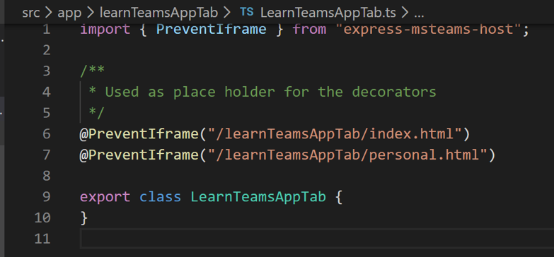

### Update you uploaded app

1. From the Teams client, select **Apps > Built for Contoso**.

1. Select the ellipse (**...**) and select **Update**.

    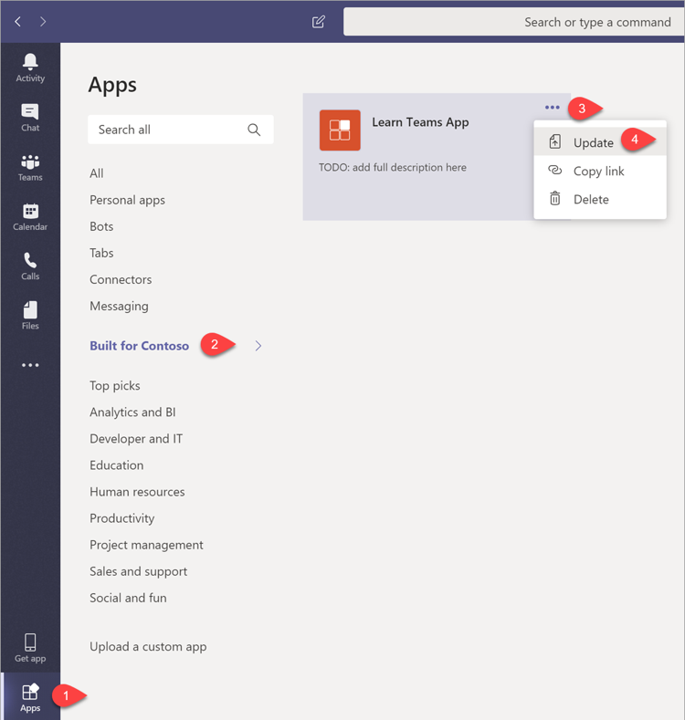

1. Browse to your **MyTeamsApp.zip** file and select **Open**.

    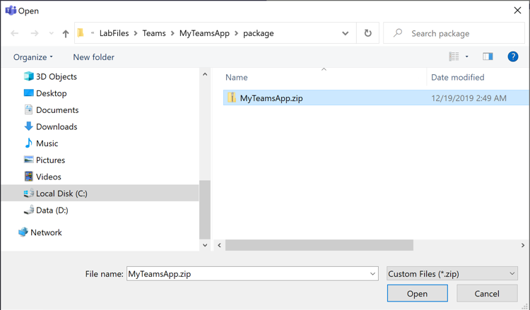

1. The upload will fail and will display a message about the version number.

    

1. Go back to your solution in Visual Studio Code. Open the manifest.json and up the version number by 1 increment. Since the current version is 0.0.1 change it to 0.0.2.

    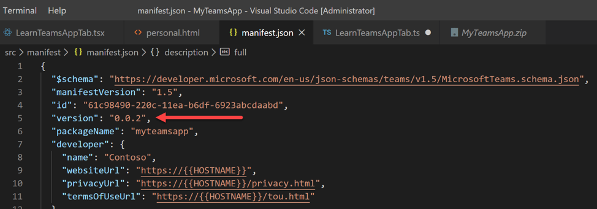

1. Press CTRL+C to stop the local web server. Run the following commands:

    ```powershell
    gulp build
    gulp ngrok-serve
    ```

1. Go back to Teams and try the upload again.

### View your personal tabs

In the navbar located at the far left of the Teams client, select the **...** menu and choose your app from the list.

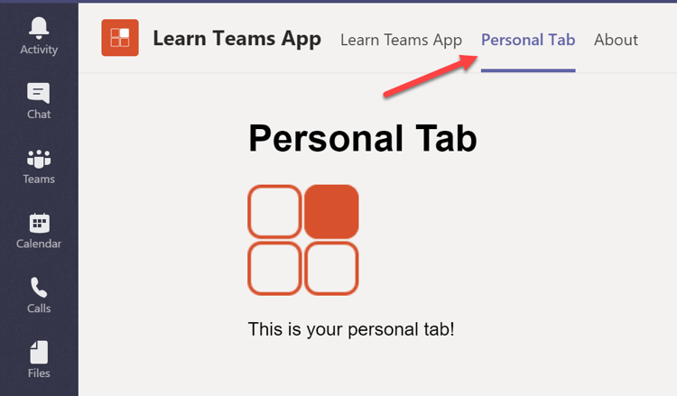

## Task 2: Use App Studio to update the Teams app manifest

In the initial test, when you added the app to Teams, it had a few "TODO" strings for describing the app. You could change those values directly in the manifest or use App Studio instead.

### Import the existing package

1. In the app bar, select ... **More added apps** and then select **App Studio**.

1. If App Studio has never been installed, you need to select **Add**. You will see **Open** if it’s already been added.

1. In App Studio, select the **Manifest editor** tab, then select **Import an existing app**. Open the project's **../package** folder, and then open the **MyTeamsApp.zip** file.

1. You should now see your imported app which you can now select to open.

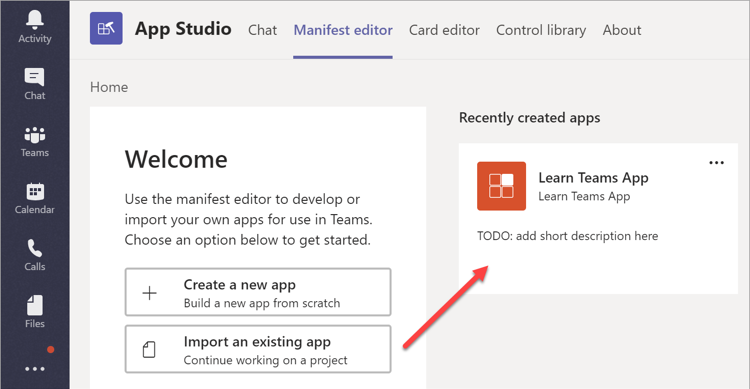

### Update app manifest

Now you can modify your app manifest here in App Studio.


1. On the **App details** page, change the **Long name** of the app to **Learn Microsoft Teams Tabs**.

1. On the **App details** page, scroll down to the **Descriptions** section and enter the following values:

    - **Short description**: Enter **My first custom Teams app**

    - **Long description**: Enter a longer description of your choice.**

1. Change the **Version** to **0.0.3**.

1. In the App Studio navigation pane, update the tab name by selecting **Capabilities > Tabs**.

1. Locate the only personal tab in the project, and then select **... > Edit** on that tab.

1. Change the tab name to **My First Tab**.

1. Select **Save** to save your changes.

1. Now you need to download the package. The changes you make in App Studio aren't saved to your project. To update the project, download the app package from App Studio. To download the project, in the App Studio navigation pane select **Finish** > **Test and distribute**, and then select **Download**.

    **Warning**:
    Be careful if you chose to update the **manifest.json** file in your project with the one in the package downloaded from App Studio.
The manifest file in your project contains placeholder strings that are updated by the build and debugging process. 
For instance, the **{{HOSTNAME}}** placeholder is replaced with the app's hosting URL each time the package is recreated. Because of that, you may not want to completely replace the existing **manifest.json** file with the file generated by App Studio.

1. Now you need to update your uploaded app. From the Teams client, select **Apps > Built for Contoso**. Select the ellipse (**...**) and select **Update**.

1. Browse and upload the updated zip package. Open the app and notice it’s now reflecting the updates you made.

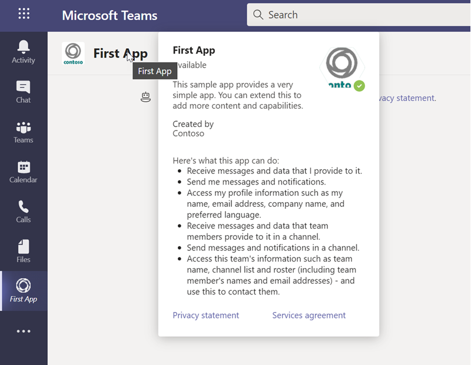

## Task 3: Create a custom Microsoft Teams channel or group tab

This exercise explains how to create a channel tab with a configuration page in a Teams app.

### Create new Teams app project

1. Launch PowerShell.

1. Navigate to **C:/LabFiles**, create a new directory named **TeamsChannelTab** and changed to the new directory by executing the commands:

    ```powershell
    cd C:/LabFiles
    md TeamsChannelTab
    cd TeamsChannelTab
    ```

### Run the Yeoman Teams generator

1. Run the following command:

    ```powershell
    yo teams
    ```

1. Yeoman launches and asks a series of questions. Answer them with these values:

    - **What is your solution name?**: TeamsChannelTab

    - **Where do you want to place the files?**: Use the current folder

    - **Title of your Microsoft Teams App project?**: Teams Channel Tab

    - **Your (company) name? (max 32 characters)**: Contoso

    - **Which manifest version would you like to use?**: 1.5

    - **Enter your Microsoft Partner Id, if you have one?**: (Leave blank to skip)

    - **What features do you want to add to your project?**: A Tab

    - **The URL where you will host this solution?**: https://myteamsapp.azurewebsites.net

    - **Would you like to include Test framework and initial tests?**: No

    - **Would you like to use Azure Applications Insights for telemetry?**: No

    - **Default Tab name? (max 16 characters)**: ConfigMathTab

    - **Do you want to create a configurable or static tab?**: Configurable

1. Once Yeoman is finished generating the solution, navigate to the newly created project directory by executing the command: `cd myteamsapp`

1. Launch the project in Visual Studio Code by executing the command: `code .`

After you answer the generator's questions, the generator adds the files for the new components, then executes `npm install` to download the project dependencies.

### Test the channel tab

Before you customize the tab, test the user experience.

1. From the command line, navigate to the project's root folder and run the following command:

    ```powershell
    gulp ngrok-serve
    ```

1. Using the app bar navigation menu, select the **Mode added apps** button. Then select **Browse all apps** followed by **Upload for me or my teams**.

    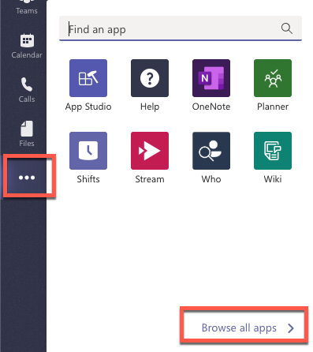

1. In the file dialog that appears, open the **/package** folder and select the .zip file.

1. When the package finishes uploading, Teams displays a summary of the app.

1. Select the arrow next to the **Add** button and select **Add to a team** to install the app.

    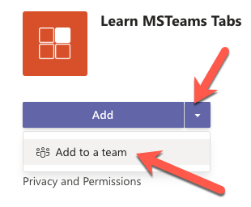

1. In the **Select a channel to start using...** dialog box, select an existing team and then select **Set up a tab**.

    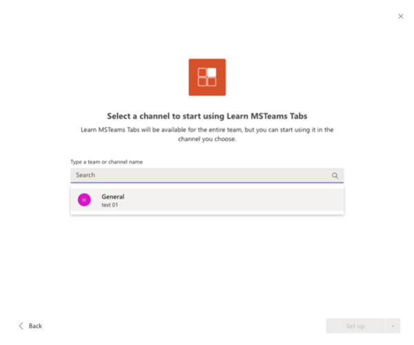

1. Before adding the tab to the team, Teams displays the tab's configuration page.

    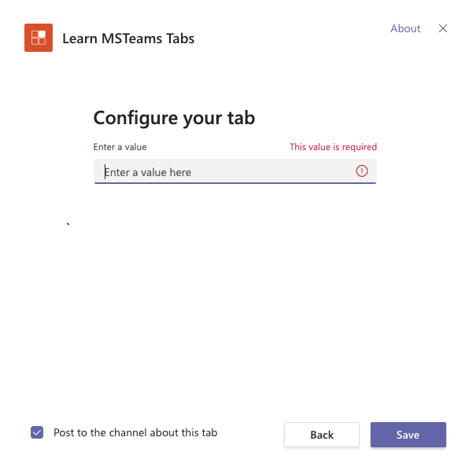

1. Enter anything in the text box and select **Save**.

Teams adds the tab to the channel, and the text you entered in the configuration page appears in the tab.

## Review

In this exercise, you:

- Created a personal tab.

    - Updated the controls to the Stardust library and added a user interface.

    - Updated the manifest.

    - Installed and tested the tab.

- Created a channel tab with a configuration page.

    - Updated the configuration tab and page with logic and a user interface.

    - Implemented the tab and configuration page.

    - Tested your work.

Well done! You built an app.

